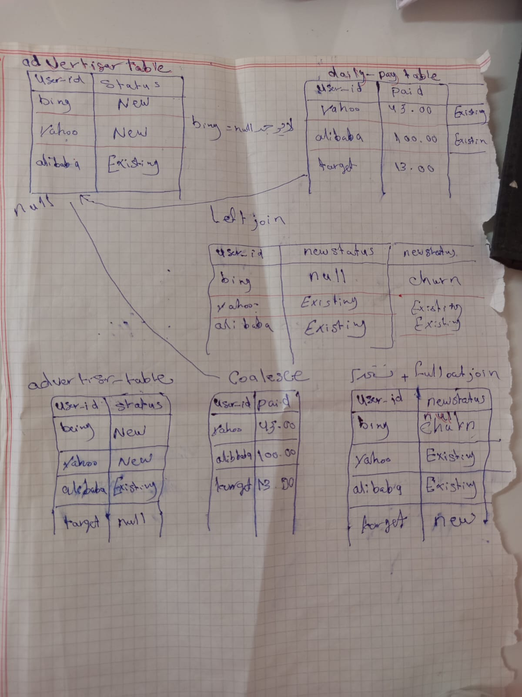

# 📊 حلول تحديات موقع SQL-Practice

مستودع يحتوي على حلولي وتطبيقاتي البرمجية لأسئلة وتحديات قواعد البيانات من موقع [SQL-Practice](https://sql-practice.com).

## 🛠️ التقنيات المستخدمة
* **SQL (SQLite / MySQL)**
* **قواعد بيانات المرضى (Patients Database)**

## 📑 قائمة الحلول المنجزة

### 1. تحديث بيانات الحساسية (Allergies Update)
* **الوصف:** تحديث القيم الفارغة (NULL) في عمود الحساسية إلى 'NKA'.
* **الكود:**
```sql
UPDATE patients
SET allergies = 'NKA'
WHERE allergies IS NULL;
```

### 2. دمج الاسم الكامل (Full Name Concatenation)
* **الوصف:** دمج الاسم الأول والأخير للمرضى في عمود واحد باسم `full_name`.
* **الكود:**
```sql
SELECT first_name || ' ' || last_name AS full_name
FROM patients;
```

### 3. ربط المرضى بالمقاطعات (JOIN Challenge)
* **الوصف:** عرض اسم المريض الأول والأخير مع اسم مقاطعتهم الكامل عبر ربط الجداول.
* **الكود:**
```sql
SELECT p.first_name, p.last_name, pn.province_name
FROM patients p
JOIN province_names pn ON p.province_id = pn.province_id;
```

---
💡 *يتم تحديث هذا المستودع باستمرار مع كل تحدٍ جديد أقوم بحله!*
## 📝 التخطيط المنطقي للربط بين الجداول (SQL Join & Coalesce Logic)

قبل كتابة استعلامات السيكوال، قمت برسم وتخطيط آلية دمج الجداول منطقياً على الورق لضمان معالجة القيم الفارغة (`Null values`) واختبار أنواع الـ Joins المختلفة:

* **Left Join**: لربط جدول الإعلانات بجدول المدفوعات مع الحفاظ على كافة المستخدمين.
* **Coalesce Function**: لتنظيف وتحسين عرض البيانات من خلال دمج الأعمدة واستبدال القيم الفارغة.
* **Full Outer Join**: لضمان دمج كامل البيانات من الطرفين وتحديد المستخدمين الجدد وحالات المغادرة (`Churn`).



